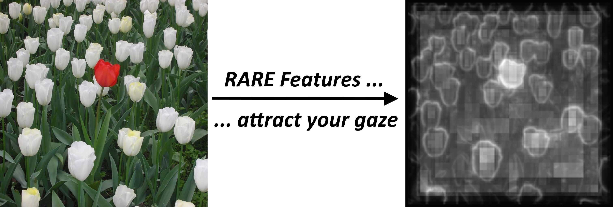

# VisualAttention-RareFamily

We provide several codes to compute image saliency from the Rare family. The philosophy of those models is that a specific feature does not necessarily attract human attention, but what attracts it is a feature which is rare, thus surprising and difficult to learn. 
>  
> Initial image on the left and raw saliency map (probability for each pixel to attract human attention) on the right. No filtering or centred Gaussian applied here. 

## DeepRare2019 (DR2019)
Rarity is computed on the deep features extracted by a VGG16 trained on ImageNET. No training is needed. This model is neither "feature-engineered saliency model" as features come from a DNN model, nor a DNN-based model as it needs no training on an eye-tracking dataset: the default ImageNET training of the provided VGG16 is used. It is thus a "deep-engineered" model.

#### Use DR2019
A full paper can be found here : [https://arxiv.org/abs/2005.12073](https://arxiv.org/abs/2005.12073) and here is the [Github Project page](https://github.com/numediart/VisualAttention-DeepRare2019) .

#### Cite DR2019
If you use DR2019, please cite :   
>  `@misc{matei2020visual,  
 title={Visual Attention: Deep Rare Features}, author={Mancas Matei and Kong Phutphalla and Gosselin Bernard}, year={2020}, eprint={2005.12073}, archivePrefix={arXiv}, primaryClass={cs.CV}}`  

#### Special strength of DR2019
* Fully generic model with no training needed. Just run it on your images!
* Works better than Rare2012 and any other feature-engieneered model and better than some DNN-based models on general images dataset (MIT, ...)
* Works better than any DNN-based model on one-odd-out datasets (like P3, O3, ...) and is always in top-3 withe feature-engineered models
* Let you check the contributions of different VGG16 layers to the final result
* Fast even when ran only on CPU

## Rare 2012 (R2012)

Comming soon. Rare2012 is a state-of-the-art feature-engineered saliency model. 

## Rare 2007 (R2007)

Comming soon. Rare2007 is the first feature-engineered saliency model based on the feature histogram rarity. 
